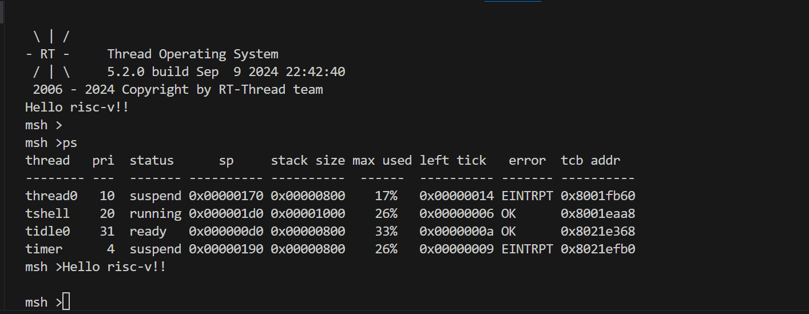

# Qemu risc-v virt bsp

## 1. 如何编译

1. 设置工具链路径
   * export RTT_EXEC_PATH=~/riscv/bin/
2. 修改 rt-config.py 中工具链前缀
   * PREFIX = 'riscv64-unknown-elf-'
3. 编译
   * scons -j16

## 2. 运行

1. 终端执行 `qemu_run.sh`，运行结果如图：

## 3. 退出

1. 终端执行 `Ctrl A + X`

